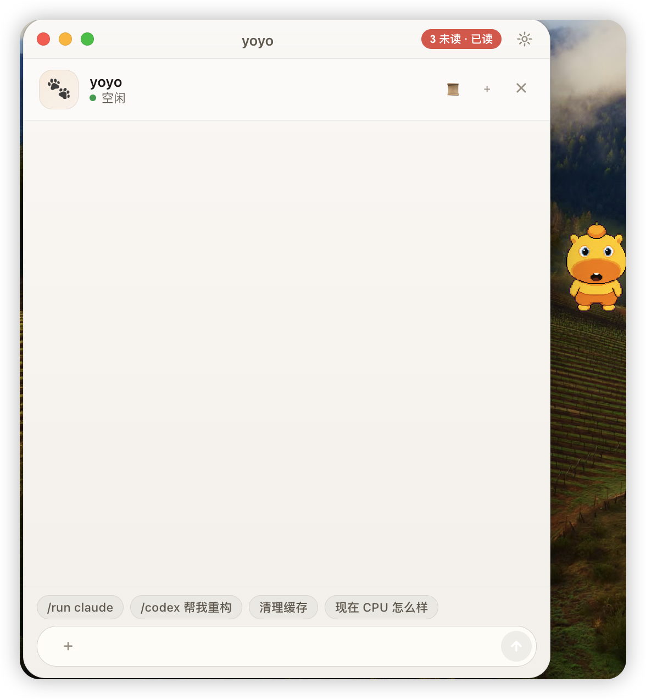
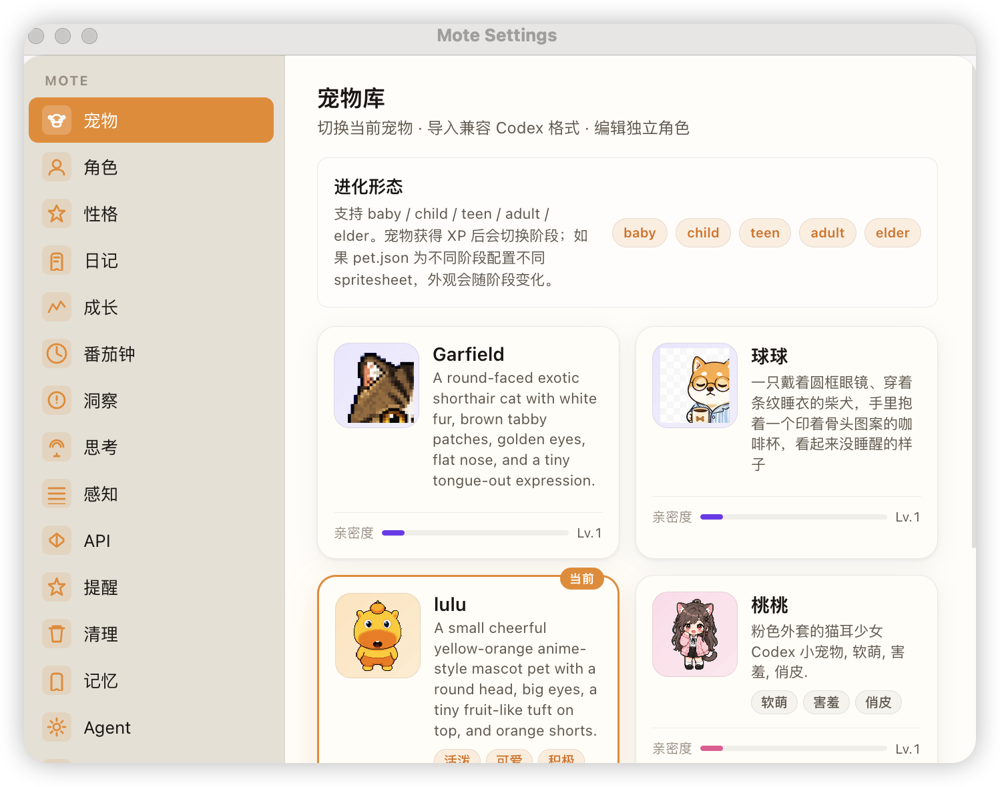
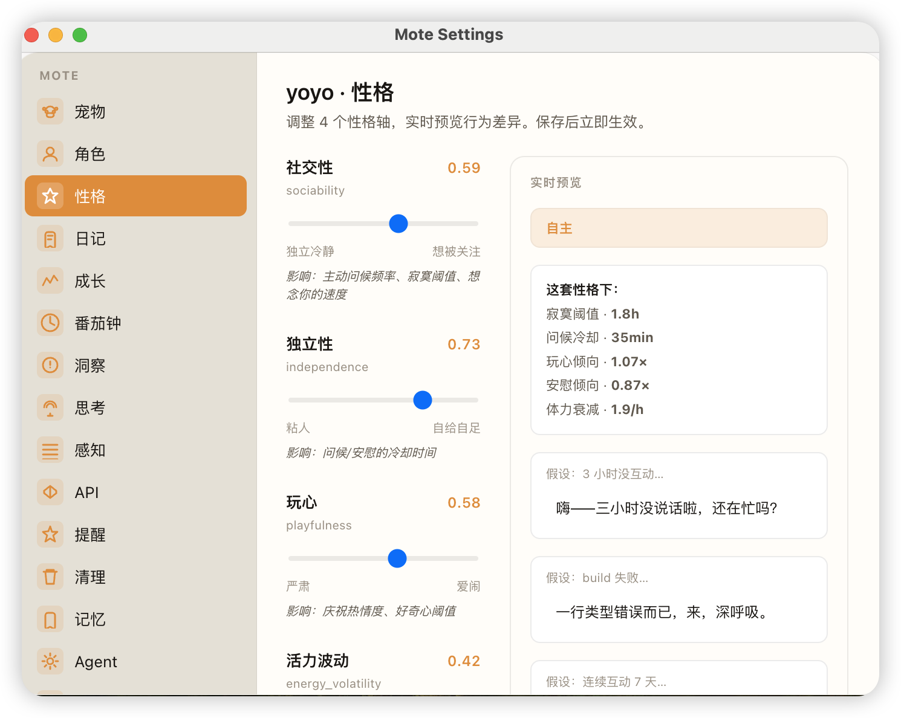

<p align="center">
  
</p>

<h1 align="center">Mote</h1>

<p align="center">
  <b>AI Desktop Pet — Your AI companion lives on your desktop</b>
</p>

<p align="center">
  
  
  
</p>

<br />

Mote 是一款 macOS 桌面宠物应用，搭载大语言模型，让 AI 拥有身体、性格和记忆。它不只是聊天窗口——它会在你工作时陪伴你、记住你的习惯、主动关心你，还会随着互动慢慢成长。

<!-- TODO: 替换为你的截图 -->
> **screenshots go here** — 桌面宠物、聊天面板、设置页面

---

## 功能亮点

### 桌面宠物

漂浮在桌面上的 AI 角色，有独立的精灵动画（idle / talk / working / alert / celebrate），随情绪切换动作。内置多个角色，也支持 AI 生成自定义宠物。

### 聊天 & Agent

点击宠物打开对话面板。支持多模态（文字 + 图片），拥有完整的 Agent 循环——宠物可以执行 Shell 命令、读写文件、调用 MCP 工具、甚至派遣 Claude Code / Codex 完成复杂任务。

### 情绪 & 成长系统

宠物有 6 种情绪（开心 / 平静 / 疲惫 / 担心 / 兴奋 / 想念你），根据系统负载、互动频率、时间段实时变化。通过积累经验值，从幼崽成长为长者，每次进化都会改变性格和说话方式。

### 性格自适应

4 个性格维度（社交性 / 独立性 / 玩心 / 活力波动）会根据你的使用习惯缓慢调整。深夜活跃？宠物会变得更独立。频繁聊天？社交性会提升。

### 记忆 & 技能学习

宠物会记住关于你的事实（偏好、项目、背景），并在对话后自动提炼。还能从任务中沉淀 Playbook——"下次遇到类似情况该怎么做"。

### 主动关怀

宠物会根据议程系统主动冒泡提醒：打招呼、关心进度、提醒休息、分享观察。不是被动等待你发消息，而是主动关心你。

### 后台任务

设置定时或手动的 Agent 后台任务，让宠物在你离开时持续监控或执行操作。

### Pomodoro 计时

内置番茄钟，专注工作 25 分钟，宠物陪你一起进入心流状态。

### 系统监控

实时监测 CPU / RAM / 磁盘使用率，宠物会根据系统负载调整状态——系统过载时会"担心"，空闲时会"平静"。

---

## 截图



> 

---

## 快速开始

### 环境要求

- macOS 12+
- Node.js 18+
- pnpm 或 npm

### 安装 & 开发

```bash
git clone https://github.com/JeremyRenjw/Move.git
cd Move
pnpm install
pnpm dev
```

### 构建发布版

```bash
pnpm dist
```

产物输出到 `dist/mac-arm64/Mote.app`。

---

## API 配置

Mote 支持两种 LLM 提供商：**Anthropic (Claude)** 和 **OpenAI 兼容**。

启动应用后，右键托盘图标 → 打开设置 → API 配置，填入你的密钥。

### Anthropic (Claude)

| 字段 | 说明 |
|------|------|
| 提供商 | 选择 `Anthropic` |
| 模型 | 如 `claude-opus-4-7`、`claude-sonnet-4-6` |
| API Key | 从 [console.anthropic.com](https://console.anthropic.com) 获取 |

### OpenAI 兼容

| 字段 | 说明 |
|------|------|
| 提供商 | 选择 `OpenAI 兼容` |
| 模型 | 如 `gpt-4o`、`gpt-5`、`deepseek-chat` 等 |
| API Key | 你的 OpenAI 或兼容平台的密钥 |
| Base URL | 自定义端点，如 `https://api.openai.com/v1`；本地部署填本地地址 |

> API Key 使用 macOS Keychain 加密存储，不会保存到源码或配置文件中，安全可靠。

---

## 项目结构

```
Move/
├── electron/             # Electron 主进程
│   ├── main.ts           # 入口 & IPC 注册
│   ├── ai.ts             # LLM 引擎（Claude + OpenAI）
│   ├── mood-engine.ts    # 情绪 & 成长系统
│   ├── trait-learner.ts  # 性格自适应学习
│   ├── reflector.ts      # 周期性反思 & 主动关怀
│   ├── agenda.ts         # 议程规划（LLM 驱动）
│   ├── curator.ts        # 知识库整理
│   ├── fact-store.ts     # 事实记忆存储
│   ├── playbook-store.ts # 技能/Playbook 存储
│   ├── event-store.ts    # 事件流存储
│   ├── insights.ts       # 行为洞察分析
│   ├── windows.ts        # 窗口管理
│   ├── tray.ts           # 系统托盘
│   ├── pets.ts           # 宠物管理 & 切换
│   └── ...
├── src/
│   ├── float/            # 桌面宠物窗口
│   ├── panel/            # 对话面板窗口
│   └── settings/         # 设置窗口
├── src-shared/           # 共享类型定义
├── assets/               # 宠物精灵图 & 应用图标
│   └── pets/             # 内置宠物资源
└── tests/                # 单元测试
```

---

## 技术栈

- **Electron** — 桌面应用框架
- **React** — UI 渲染
- **TypeScript** — 类型安全
- **Anthropic SDK / OpenAI SDK** — LLM 接入
- **MCP SDK** — Model Context Protocol 工具扩展

---

## 开发命令

| 命令 | 说明 |
|------|------|
| `pnpm dev` | 启动开发模式 |
| `pnpm build` | 构建生产版本 |
| `pnpm dist` | 构建 & 打包 macOS 安装包 |
| `pnpm test` | 运行测试 |
| `pnpm test:watch` | 监听模式运行测试 |

---

## License

MIT

---

<p align="center">
  <sub>Made with care — your AI deserves a body.</sub>
</p>
